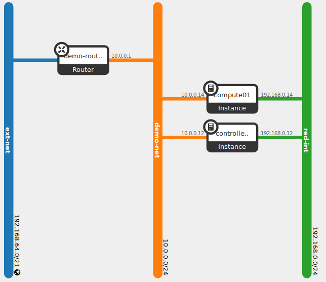

# Instalación automática de OpenStack con Ansible

## Requisitos

* Máquina de control de Ansible
  * Ubuntu 16.04 LTS
  * Python 2.7.1
  * Ansible 2.3.1
* Máquinas remotas
  * Ubuntu 16.04 LTS
  * Python 2.7.1

## Consideraciones

* Este proyecto instala OpenStack en un nodo de control (`control`) y un nodo de cómputo (`compute01`).
* La instalación de OpenStack en los dos nodos remotos (`controller` y `compute01`) la haremos directamente desde el nodo de control de Ansible. Por tanto, los dos nodos remotos tendrán:
  * Una dirección IP accesible desde el nodo de control de Ansible. Las direcciones IP de los nodos remotos están en el archivo `hosts.cfg`.
  * La clave pública SSH correspondiente a clave SSH instalada en el nodo de control de Ansible.
* El archivo `group_vars/all.yml` contiene parámetros que se pueden ajustar a los valores que necesites para tu instalación de OpenStack (p.e. direcciones IP de los nodos de control y cómputo, nombre de las interfaces de red, contraseñas, ...)
* El usuario de las máquinas remotas es `ubuntu` (esto sólo es necesario para lanzar el despliegue).

## Entorno

## Despliegue

Una vez ajustados los valores en `hosts.cfg` y `group_vars/all.yml` el despliegue se realiza con

`$ ansible-playbook site.yml -u ubuntu`
